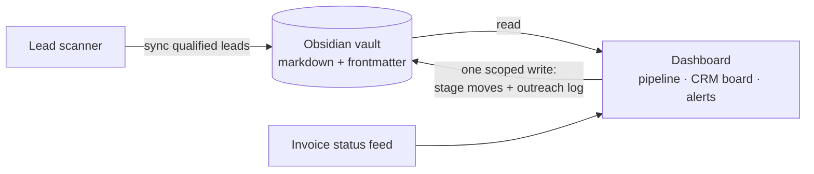

# TOMKO OS — Showcase

Curated excerpts from the operations cockpit I built and run for my web studio, [Tomko Digital](https://www.tomkodigital.com). It's a local Next.js app that turns a folder of plain markdown notes (an Obsidian vault) into a live command center: sales pipeline, a kanban CRM board, stale-lead alerts, invoice/payment status, and AI token-budget monitors.

**Why excerpts?** The full app basically encodes how my business runs — targeting logic, internal plans, playbooks. You get the engineering ideas here; the operational tuning stays mine.

## The idea worth stealing: the vault is the database

Every lead, client, and decision lives as a markdown note with YAML frontmatter in an Obsidian vault. The dashboard doesn't own any data — it *reads* the vault and renders it as a cockpit. One carefully-scoped API route is allowed to write back (moving a lead between pipeline stages), and everything else is read-only by design.

That buys me three things: I can edit the data anywhere markdown works, every AI session I run reads the same ground truth, and I never do a schema migration.

## What each file shows

| File | What it demonstrates |
|---|---|
| [`lib/vault/notes.ts`](lib/vault/notes.ts) | The whole "vault as database" layer — markdown + frontmatter parsing every reader shares |
| [`lib/vault/leads.ts`](lib/vault/leads.ts) | Lead domain model: single-field pipeline stages, staleness derived from an outreach log inside the note itself |
| [`app/outreach/`](app/outreach/) | The CRM kanban board — server component reads the vault, client component moves cards |
| [`app/api/leads/move/route.ts`](app/api/leads/move/route.ts) | The one sanctioned write: stage + dated log line, with path-traversal guards and note-type checks at the trust boundary |
| [`lib/originGuard.ts`](lib/originGuard.ts) | CSRF posture for a localhost app — because "it only binds localhost" is not a security model |

## Stack

Next.js 15 (App Router) · React 19 · Tailwind v4 · hand-authored design system (no component libraries) · three.js for the ambient display. Built in partnership with Claude as my development copilot.

---

Related: [lead-scanner architecture](https://github.com/anonmilkbox/lead-scanner) · [invoice app showcase](https://github.com/anonmilkbox/invoice-creator-showcase) · [github.com/anonmilkbox](https://github.com/anonmilkbox)
